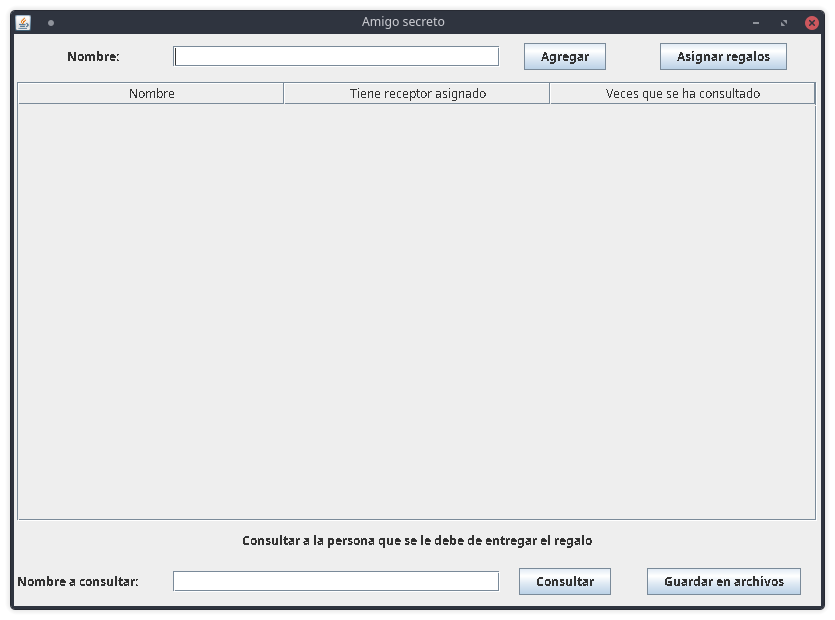

# Amigo Secreto
Add all the names of the participants before assigning the gifts.
After they have been assigned, you can check by name, who is going to receive the gift by that person.
It can also export the result to separate txt files so it can be checked later one by one to avoid spoiling other person's gift.

